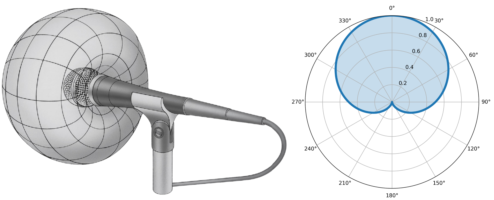
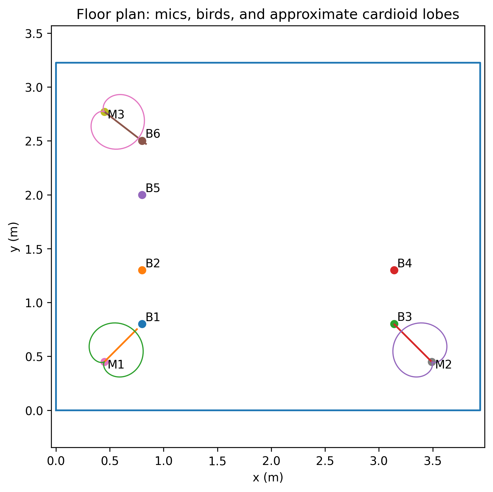
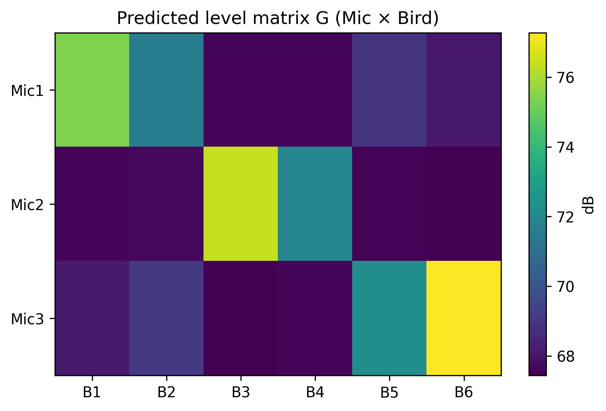
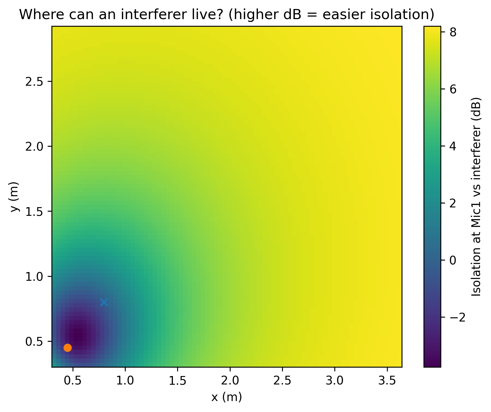

# **Acoustic Scene Analysis on Songbirds**
This project investigates auditory scene analysis in songbirds — the ability to segregate and identify individual vocal signals within complex acoustic environments, akin to the human “cocktail party problem.” By creating a controlled acoustic setup that enables simultaneous recording of multiple vocalizing birds, we aim to study how spatial and spectral cues contribute to source separation, communication, and perception in naturalistic group settings.

### **Microphone Directivity and Polar Pattern**
To accurately capture and localize vocalizations within the recording space, it is essential to characterize the directional response of the microphones used. The cardioid microphone exhibits a polar pickup pattern that emphasizes sounds originating from the front while attenuating those from the sides and rear. This directional sensitivity helps reduce interference from neighboring sound sources and room reflections — a critical feature when multiple birds vocalize simultaneously. The following polar diagram illustrates the typical response pattern of the cardioid microphone employed in this study, highlighting its angular sensitivity across different frequencies. Mathematically, its polar response follows: 

$$ P(\theta) = 0.5 \times (1 + \cos\theta)$$,

where $\theta$ is the angle between the mic’s forward axis and the direction of the incoming sound.

### **Floor Map Overview**
The floor map illustrates the spatial arrangement of microphones and bird cages within the controlled acoustic room used for the mountain chickadee vocalization recordings. Each microphone (AKG C1000 S, cardioid configuration) is positioned to optimize sound isolation and clarity, with its cardioid lobe oriented toward the designated target cages. The diagram provides a top-down view of the room, showing both the mic positions and approximate pickup patterns, as well as the relative placement of bird cages.

This visualization serves as a reference for interpreting microphone coverage, directionality, and potential acoustic overlap between recording zones.

### **Crosstalk Matrix (dB)**
The crosstalk matrix quantifies the relative signal levels captured by each microphone from every bird source, expressed in decibels (dB). Each cell represents the estimated level difference between the target bird for a given microphone (diagonal entries) and the leakage from other birds (off-diagonal entries). This visualization provides a concise way to assess recording isolation and identify potential overlap between zones. Higher negative values indicate greater acoustic separation, meaning less contamination from neighboring cages. The matrix is derived from the room geometry, microphone directivity pattern (cardioid), and relative distances between sources and receivers, assuming a diffuse field consistent with a well-treated room. It serves as a diagnostic and design tool to guide microphone placement, aiming, and cage arrangement to achieve optimal source discrimination.

### **Isolation Field Maps**

The isolation field maps visualize the spatial distribution of microphone sensitivity and source separation across the recording area. Each map represents how well a given microphone can isolate its target bird from other potential sound sources within the room. The color gradient encodes relative isolation levels (in dB), combining the effects of microphone directivity, distance-dependent attenuation, and the expected contribution of room reflections. Regions of higher isolation correspond to areas where the target signal dominates and interference from other cages or reflections is minimal. These maps provide an intuitive spatial perspective on where additional cages can be introduced or repositioned without significantly degrading recording independence, making them a practical design aid for optimizing microphone placement and room layout in multi-source acoustic experiments.

